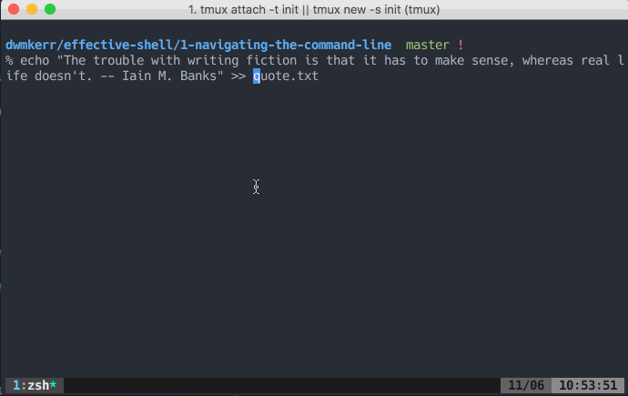
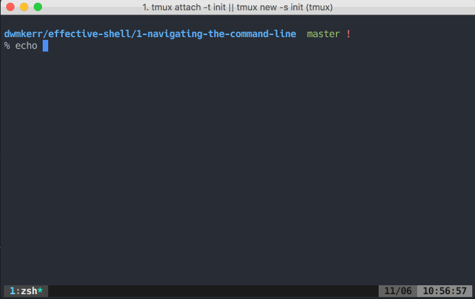

# Effective Shell Part 1 - Navigating the Command Line

This is the [first part of a series](https://github.com/dwmkerr/effective-shell) I writing which contains practical tips for using the shell more effectively.

I can't think of a better place to start than *navigating the command line*. As you start to do more and more in the shell, text in the command line can quickly become hard to handle. In this article I'll show some simple tricks for working with the command line more effectively.

Here's a quick reference diagram, the rest of the article goes into the details!

[](https://github.com/dwmkerr/effective-shell)

This article, examples and diagrams are available at [github.com/dwmkerr/effective-shell](https://github.com/dwmkerr/effective-shell).

<!-- TOC depthFrom:2 depthTo:3 withLinks:1 updateOnSave:1 orderedList:0 -->

- [Basic Navigation](#basic-navigation)
- [Searching](#searching)
- [Editing In-Place](#editing-in-place)
- [Clear the Screen](#clear-the-screen)
- [Pro Tip: Transposing!](#pro-tip-transposing)
- [Closing Thoughts](#closing-thoughts)

<!-- /TOC -->

## Basic Navigation

Let's assume we have a very simple command we are writing, which is going to write a quote to a text file:

```bash
echo "The trouble with writing fiction is that it has to make sense,
whereas real life doesn't. -- Iain M. Banks" >> quote.txt
```

Navigating around long lines of text is a slow process if you are only relying on the arrow keys, so take the time to learn the following shortcuts:

| Action                                  | Shortcut                | Example                                                |
|-----------------------------------------|-------------------------|--------------------------------------------------------|
| Go to beginning / end                   | `Ctrl + a` / `Ctrl + e` |                    |
| Go backwards / forwards one word        | `Alt + b` / `Alt + f`   |     |
| Delete a word / undo                    | `Ctrl + w` / `Ctrl + -` |                |
| Delete next word                        | `Alt + d`               |        |
| Delete all the way to the beginning[^1] | `Ctrl + u`              |  |
| Delete all the way to the end           | `Ctrl + k`              |              |

## Searching

Once you have the basic navigation commands down, the next essential is searching. Let's assume we've run the following three commands:

```bash
$ command1 param1 param2 param3
$ command2 param4 param5 param6
$ command3 param7 param8 param9
```

You can search backwards or forwards with `Ctrl + r` and `Ctrl + s`. This will search in the current command and then iteratively through previous commands:


This is useful for searching in the current command, but can be also used to quickly search backwards and forwards through the command history:


As you type, your command history is searched, the most recent commands coming first. Use the arrow keys to edit the command, press enter to execute it, or `Ctrl + g` to cancel the search.

Here are the same commands applied to the original example:

| Action                  | Shortcut      | Example                                                |
|-------------------------|---------------|--------------------------------------------------------|
| Search backwards / forewards | `Ctrl + r` / `Ctrl + s`   |  |
| Run the command         | `Enter`       |           |
| Edit the command        | `Right Arrow` / `Left Arrow` |         |
| Stop searching          | `Ctrl + g`    |      |

## Editing In-Place

These tips and tricks are helpful, but if you are working with a really long or complex command, you might find it useful just to jump into your favourite editor.

Use `Ctrl + x , Ctrl + e` to edit-in place:



In a later article I'll talk a little more about how to configure the default editor.

## Clear the Screen

Probably the shortcut I use the most is `Ctrl + l`, which clears the screen without trashing your current command. Here's how it looks:



## Pro Tip: Transposing!

If you've mastered all of the commands here and feel like adding something else to your repertoire, try this:


The `Alt + t` shortcut will transpose the last two words. Use `Ctrl + t` to transpose the last two letters:


These were new to me when I was researching for this article. I can't see myself ever being able to remember the commands more quickly than just deleting the last two words or characters and re-typing them, but there you go!

## Closing Thoughts

If you are ever looking to go deeper, then search the web for *GNU Readline*, which is the library used under the hood to handle the command line in many shells. You can actually configure lower level details of how all shells which use readline work, with the [`.inputrc`](https://www.gnu.org/software/bash/manual/html_node/Readline-Init-File.html) configuration file.

The great thing about learning these shortcuts is that they will work in any prompt which uses GNU Readline. This means everything you've learnt applies to:

1. Bash
2. zsh
3. The Python REPL
4. The Node.js REPL

And probably a whole bunch more[^2].

All of these shortcuts should be familar to Emacs users. There is in fact a 'Vi Mode' option for readline, which allows you to use vi commands to work with text. You can enter this mode with `set -o vi`, I'll likely come back to this in detail in a later article.

There's a great cheat sheet on emacs readline commands at [readline.kablamo.org/emacs](http://readline.kablamo.org/emacs.html), which is a very useful reference if you want to dig deeper. For this article I've tried to focus on what I think are the most useful commands (and transpose just so you can show off!).

Hope that was useful! GIFs were made with [LICEcap](http://www.cockos.com/licecap/).

#### Footnotes

[^1]: If you are using zsh, then this will clear the entire line.
[^2]: If you know of any more, please let me know and I'll update the article!

#### References

- [Wikipedia: GNU Readline](https://en.wikipedia.org/wiki/GNU_Readline)
- [GNU Org: Readline Init File](https://www.gnu.org/software/bash/manual/html_node/Readline-Init-File.html)
- [Kablamo.org: Readline Cheat Sheet](http://readline.kablamo.org/emacs.html)
