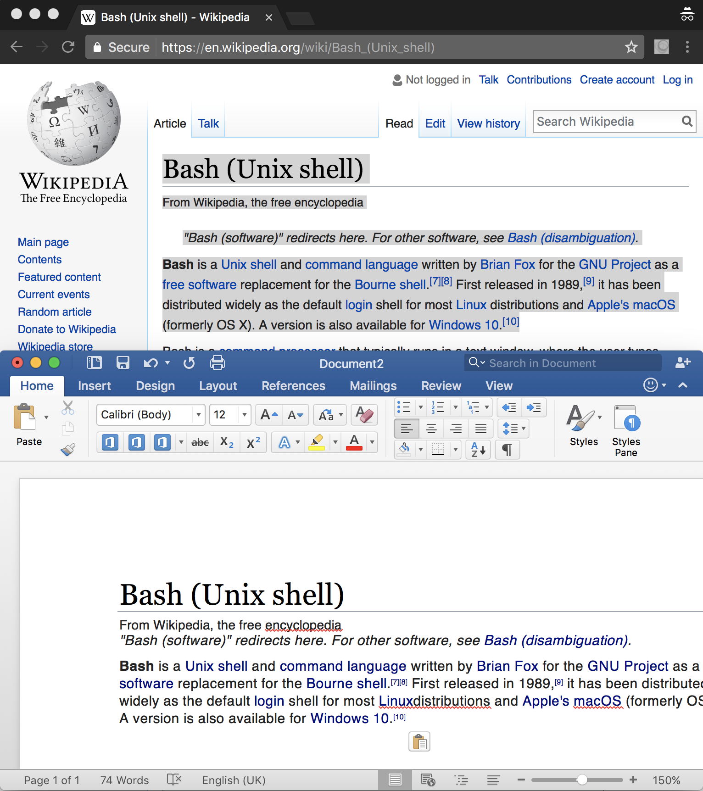
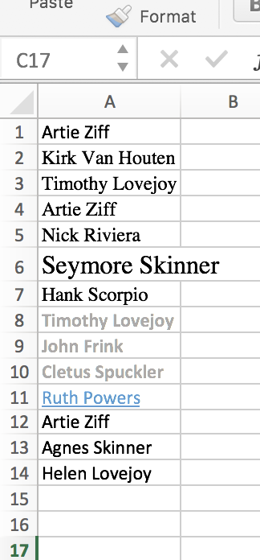

# Effective Shell Part 2 - Become a Clipboard Gymnast

This is the second part of my [Effective Shell](https://github.com/dwmkerr/effective-shell) series, which contains practical tips for using the shell to help with every day tasks and be more efficient:

- [Part 1: Navigating the Command Line](www.dwmkerr.com/effective-shell-part-1-navigating-the-command-line/)

In this article I'll show you how you can use the shell as an efficient tool to compliment how you use the clipboard.

*Note for Linux Users: In this article I'll use the `pbcopy` and `pbpaste` commands to access the clipboard, which are available on a Mac only. To get access to the same commands on other platforms, check [Appendix: Clipboard Access on Linux](#appendixclipboardaccessonlinux)*

## Use the Shell on the Clipboard

You can easily use shell commands on the contents of your clipboard. Just use `pbpaste` to output the clipboard, run the output through some commands, then use `pbcopy` to copy the result.

Try copying the following text:

```
Kirk Van Houten
Timothy Lovejoy
Artie Ziff
```

Then in the shell, run:

```bash
pbpaste
```

You should see the contents of the clipboard. Now we'll look at some ways that shell access to the clipboard can help with common tasks.

## Removing Formatting

Don't you hate it when you have to copy formatted text and don't have an easy way to paste it as *unformatted* text? Here's an example, I want to copy this Wikipedia page on 'bash', and paste it into a Word document:



Many programs have a shortcut to paste the contents of the clipboard  (such as 'command + shift + v') but if you are like me you might find yourself pasting *into* a plain text editor just to copy *out* the plain text.

If you just run the command `pbpaste | pbcopy`, you can easily strip the formatting:


We're just piping out the clipboard (which ends up as plain text, cause we're in a terminal!) and then piping that plain text *back into the clipboard*, replacing the formatted text which was there before.

This little trick can be very useful. But we can use the same pattern to quickly manipulate the contents of the clipboard in more sophisticated ways.

## Manipulating Text

Let's say someone has emailed me a list of people I need to invite to an event:



The problem is:

1. The list is in Excel and is formatted
1. The list has duplicates
2. I need to turn each name into an email address like 'Artie_Ziff@simpsons.com'

And I want to email everyone quickly.

We can quickly handle this task without leaving the shell.

Copy the raw text below if you want to try out the same commands and follow along:

```
Artie Ziff
Kirk Van Houten
Timothy Lovejoy
Artie Ziff
Nick Riviera
Seymore Skinner
Hank Scorpio
Timothy Lovejoy
John Frink
Cletus Spuckler
Ruth Powers
Artie Ziff
Agnes Skinner
Helen Lovejoy
```

First, we copy the text to the clipboard.

Now we can paste and sort:

```
$ pbpaste | sort
Agnes Skinner
Artie Ziff
Artie Ziff
Artie Ziff
Cletus Spuckler
Hank Scorpio
Helen Lovejoy
John Frink
Kirk Van Houten
Nick Riviera
Ruth Powers
Seymore Skinner
Timothy Lovejoy
Timothy Lovejoy
```

Then remove the duplicates:

```
$ pbpaste | sort | uniq
Agnes Skinner
Artie Ziff
Cletus Spuckler
Hank Scorpio
Helen Lovejoy
John Frink
Kirk Van Houten
Nick Riviera
Ruth Powers
Seymore Skinner
Timothy Lovejoy
```

Replace the underscore with an ampersand:

```
$ pbpaste | sort | uniq | tr " " "_"
Agnes_Skinner
Artie_Ziff
Cletus_Spuckler
Hank_Scorpio
Helen_Lovejoy
John_Frink
Kirk_Van_Houten
Nick_Riviera
Ruth_Powers
Seymore_Skinner
Timothy_Lovejoy
```

Then add the final part of the email address:

```
$ pbpaste | sort | uniq | tr " " "_" | sed 's/$/@simpsons.com/'
Agnes_Skinner@simpsons.com
Artie_Ziff@simpsons.com
Cletus_Spuckler@simpsons.com
Hank_Scorpio@simpsons.com
Helen_Lovejoy@simpsons.com
John_Frink@simpsons.com
Kirk_Van_Houten@simpsons.com
Nick_Riviera@simpsons.com
Ruth_Powers@simpsons.com
Seymore_Skinner@simpsons.com
Timothy_Lovejoy@simpsons.com
```

This looks perfect! We can now put the transformed text back onto the clipboard:

```
$ pbpaste | sort | uniq | tr ' ' '_' | sed 's/$/@simpsons.com' | pbcopy
```

All in all we have the following pipeline:

1. `pbpaste` - output the clipboard
2. `sort` - order the output
3. `uniq` - deduplicate the rows
4. `tr ' ' '_'` - replace spaces with underscores
5. `sed /$/@simpsons.com` - add the email domain to the end of the row

Building this in one go is hard, let's look at little more at the pipeline.

I hope this was useful! Please comment if you have any questions or tips. To see further articles as they come out, follow the repo at:

[github.com/dwmkerr/effective-shell](github.com/dwmkerr/effective-shell)

Or just follow [@dwmkerr](twitter.com/dwmkerr) on Twitter.

## Thinking in Pipelines

Some of these commands might be unfamiliar, some might not make sense, and you might be thinking 'how would I remember that'. Actually, there are many ways to solve the problem above, this is the one I came up with by *iteratively* changing my input text.

Here's what I mean - you'll see that I actually build a pipeline like this step-by-step:


(P.S - if you are wondering how I am jumping backwards and forwards a word at a time, check the last chapter '[Navigating the Command Line](www.dwmkerr.com/effective-shell-part-1-navigating-the-command-line/)').

What we're doing here is only possible because these simple commands all follow 'the Unix Philosophy'. They do one thing well, and each command expects it's input to become the input of *another* command later on. Specifically:

1. The commands are primitive and simple - `sort` is sorting a list, `uniq` is making elements unique.
2. The commands don't produce unnecessary output - `sort` doesn't add a header such as `Sorted Items`, which is great because otherwise it would clutter our pipeline.
3. We are chaining commands together, the output of one becomes the input of another.

We don't need a command such as 'Take a muddy list, sort and clean it, then turn pairs of words into an email address' - with a few simple 'workhorse' commands we can easily build this functionality ourselves.

These workhorse commands will be introduced and detailed as we go through the series. We'll also spend a lot more time looking at pipelines.

# Appendix - Clipboard Access on Linux

If you are using Linux, there is no `pbcopy` and `pbpaste` commands. You can use the [`xclip`](https://linux.die.net/man/1/xclip) tool to create equivalent commands.

First, install `xclip`:

```bash
sudo apt-get install -y xclip
```

Then add the following to your `.bashrc` file:

```bash
# Create mac style aliases for clipboard access.
alias pbcopy="xclip -selection c"
alias pbpaste="xclip -selection c -o"
```

Obviously you can use any alias you like! The article assumes that `pbcopy` and `pbpaste` have been used.
