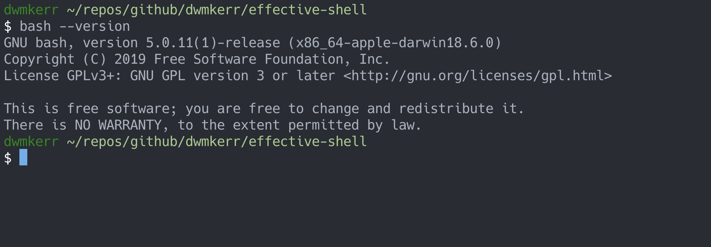
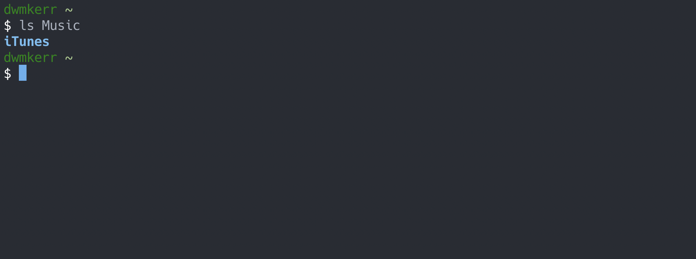
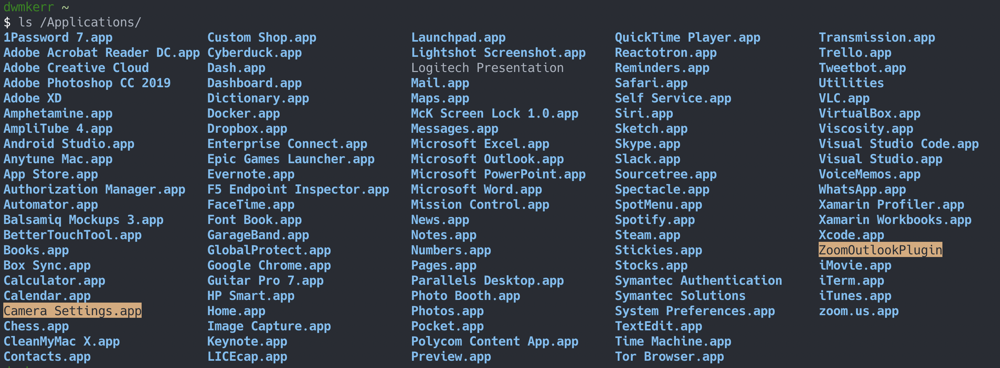
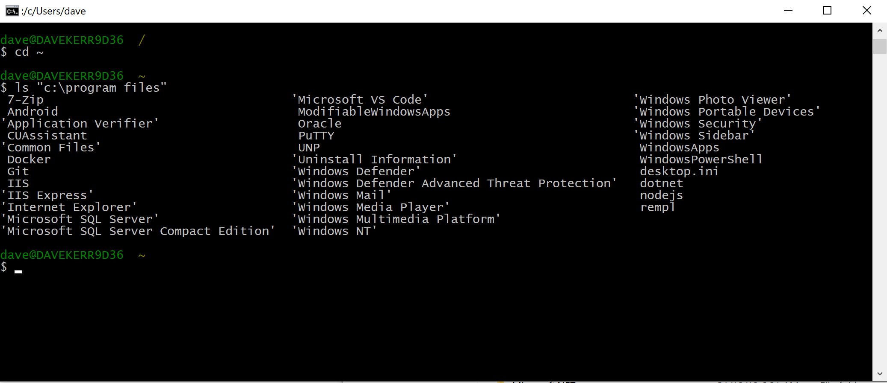
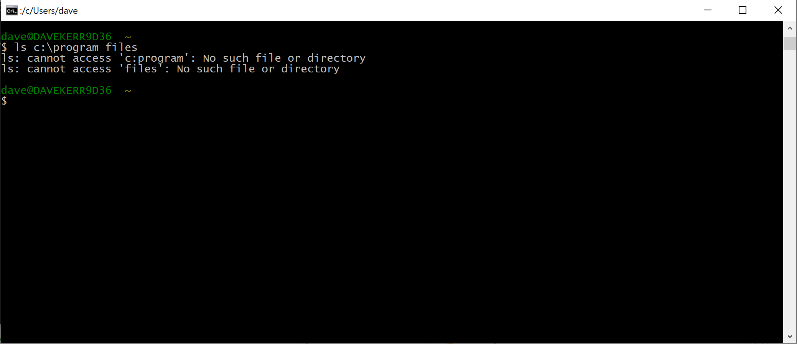
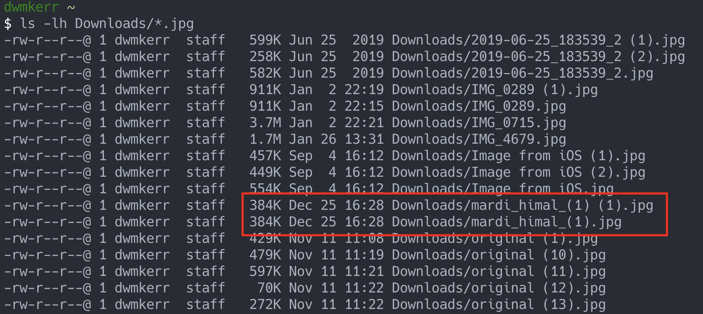
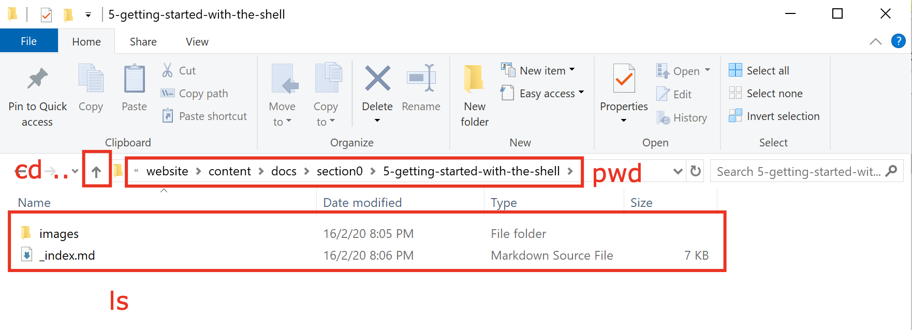

# Getting Started with the Shell

If you have never used the shell before, then this is where we'll start. We're not going to go into lots of detail, there's plenty of that later on in book. Instead we'll do a quick crash course on the basics. If you have not used the shell before this'll give you a chance to see how it works.

Start by opening your shell. This is covered in [Opening the Shell](../3-opening-the-shell/_index.md). Your shell should be _Bash_ - if this doesn't sound familiar, then make sure you have followed the instructions in [Configuring the Shell](../4-configuring-the-shell/_index.md).

You should see your terminal program running your shell. You can see what the _version_ is of your shell by running:

```sh
bash --version
```



Let's quickly dissect this. We have run the `bash` _command_. A command can be a program on your computer, or it can be something built into the shell. We'll look at this in a lot more detail later, but for now it's important to understand that a lot of what you will be doing is running commands.

The `--version` text is a _parameter_. Parameters affect how commands work. This is actually easier to see with an example.

Let's move to the _home_ folder. On most computers your home folder is your personal space where things like documents, photos, music, downloads and so on are kept.

Let's switch to the home folder by running the following command:

```sh
cd ~
```

Once you've done that, run the `pwd` command:

```sh
pwd
```


So what has happened here? The first command:

```sh
cd ~
```

Is used to _change directory_ - that's what `cd` stands for. The _parameter_ we passed to `cd` was just the 'tilde' character (`~`). This character has a special meaning in the shell - it means "the current user's home directory".

Finally, we ran the `pwd` command. This command is short for _print working directory_. It writes out to the screen _where_ you currently are.

Let's take another look at a command with some parameters. Run the following in your shell:

```sh
ls
```

The `ls` command is short for _list directory contents_ - it shows you everything that is in the current directory.

We can pass different parameters to ls. The main parameter is the location of the folder we'd like to list the contents of. So if we wanted to see what was in the `Music` folder, we'd just run:

```sh
ls Music
```

Not much to see here:



Many commands actually allow us to pass multiple parameters. For example, we could list the contents of my Movies and my personal applications:

```sh
ls Movies Applications
```


There's not much in either. You might wonder why _Applications_ is so empty - that's because we're looking at the applications _only installed for the current user_, because we are in the user's home directory. To see the applications for _everyone_ we'd need to use the folder where applications are kept for _all_ users.

We can do this by running `ls /Appliciations`:



On Windows, applications are kept in different places, but we can see some of the installed applications by running `ls "c:\program files\"`:



Why do we have the extra quotation marks here? If we ran the command without the quotation marks, the shell would think we were giving it _two_ parameters. It would think we wanted to see the contents of the `c:\program` and `files` folders - and they don't exist!



The error above shows what happens when we miss the quotation marks.

What about it I wanted to know the _size_ of the files I was seeing? I could pass the `-a` parameter, which is short for _all details_:

```sh
ls -lh Downloads/*.jpg
```



Now I can see all of the `jpg` files (`jpg` files are images) in my `Downloads` folder. Blow by blow, this is what we've got:

- `ls` - List the contents of a folder
- `-lh` - This is the _list in human-readable sizes_ parameter, which means we see how big the files are
- `Downloads/*.jpg` - Show the contents of the `Downloads` folder, including any files which end with `.jpg` - the `*` is a wildcard which means that we don't mind what the filename is

The `-lh` parameter is _shorthand_. Many commands offer longhand parameters (such as `--version`) as well as shorthand (such as `-v` as an alternative for `--version`). Longhand is easier to read, shorthand is faster to type.

Don't worry - in the next section we'll see how to look up the available parameters for a command.

Now let's look at one more command.

## The Echo Command

The 'echo' command is used to write out a message in the shell. Here's an example of how it works:

```sh
echo "Hello Shell!"
```

This command writes out the text `Hello Shell!`:


Why would we do this? One of the most common reasons would be to _see_ what the shell thinks a certain value is. For example, try this command:

```sh
echo "My home directory is at: $HOME"
```

You'll see something like this:


The `$HOME` part of the text is called a _variable_. We can recognise variables because they start with a dollar symbol. `$HOME` is a built-in variable which holds the location of the current user's home directory.

We're going to see all sorts of cool things we can do with `echo` as we continue in the book!

## Move Around

One common thing we can do in a visual file explorer is move around. We can open folders, and go 'up' from the current folder. We often also see visually where we are in the folder structure with an 'address bar'. We can actually make a quick visual that shows how to do all of this in the shell:



As a quick reference:

- `pwd` shows the current working directory - where you currently are in the file system
- `ls` lists the files in the current directory (or any directory you tell it)
- `cd ..` changes the directory to another location - if you use the special `..` directory, you are telling it to change to the _parent_ directory, i.e. 'go up' in the file system 

As a final trick, if you want to actually open something, then there is a command for that too. Unfortunately, it is different on different operating systems (but we're going to see later on how to fix that!).

Let's say I want to open one of the photos in my Downloads folder. Here's how I can do it:

```sh
cd ~/Downloads
open himalayas.jpg
```

We can see the result here:


The `open` command will open a file on MacOS. On windows you can use `start`, and on Linux you can generally use `xdg-open`.

As a nifty trick, trying running `open .` (or `start .`, or `xdg-open .`, depending on your operating system). This will open the _current folder_. Every folder contains two 'special' folders. The first is `..`, which we've seen means 'my parent folder' and the second is `.`, which means 'myself'. Having this `.` folder is convenient, as it means we can do things like this - run a command to open the current folder.

We're going to go into a lot more detail on how to work with files and folders, move around, but hopefully this has provided a crash course for the basics. They key _concepts_ to remember, which are much more important than the individual commands we've see are:

- In the shell we run _commands_
- We can change how commands work by using _parameters_
- Some parameters just go at the end of the command - like `ls Downloads`
- Some parameters start with a hyphen, and change how the command behaves - these are often called 'flags'. An example is `ls -lh`, which lists the files in the current folder with a human-readable file size

We've also learned:

- `cd` changes the current directory
- `pwd` prints the current directory
- `ls` lists the files in a directory
- `echo` can be used to write out text to the screen
- `open`, `start` and `xdg-open` can be used to open a file or folder on MacOS, Windows and Linux respectively
